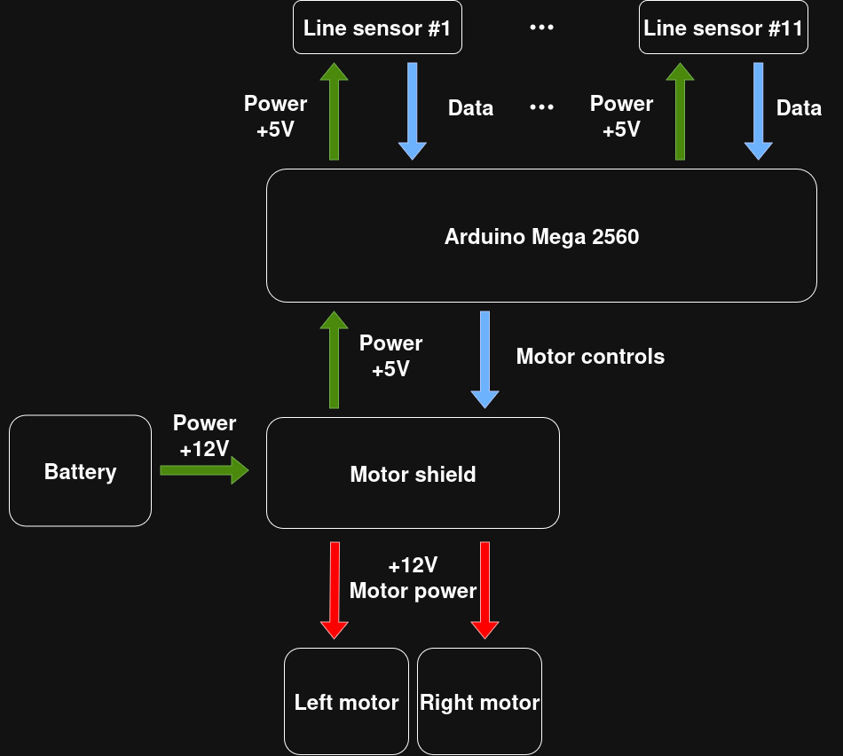

# UPML Robotics

## List of electronic components:
- 11 digital infrared line sensors;
- Arduino Mega 2560;
- Arduino motor shield rev3;
- 33GB-520 DC motors;
- All kinds of Dupont wires.

## Other
- Makeblock metal plates;
- Makeblock rubber wheels;
- Plexiglass.

## diagram

## dependences
- It is compiled using arduino IDE with flag -O3 to enable optimization.
- Python 3 is required for generation of lookup table for sensors.

## files
- upml_robotics.ino - is the main file with code for arduino;
- sensors_pos_maker.py - is a script for generating sensors_pos.h lookup table;
- ports.txt - is a table with all ports for Arduino Mega 2560;
- libio.h - is a library for controling motors.
